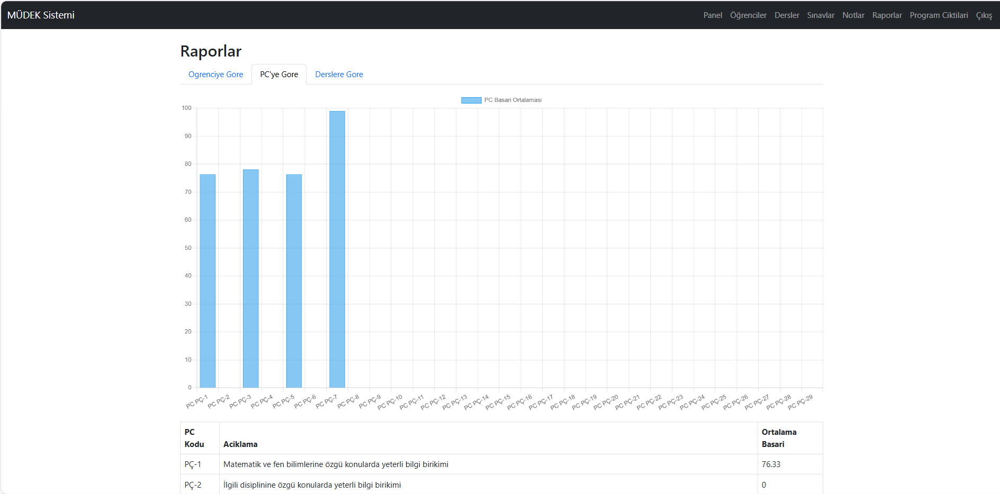
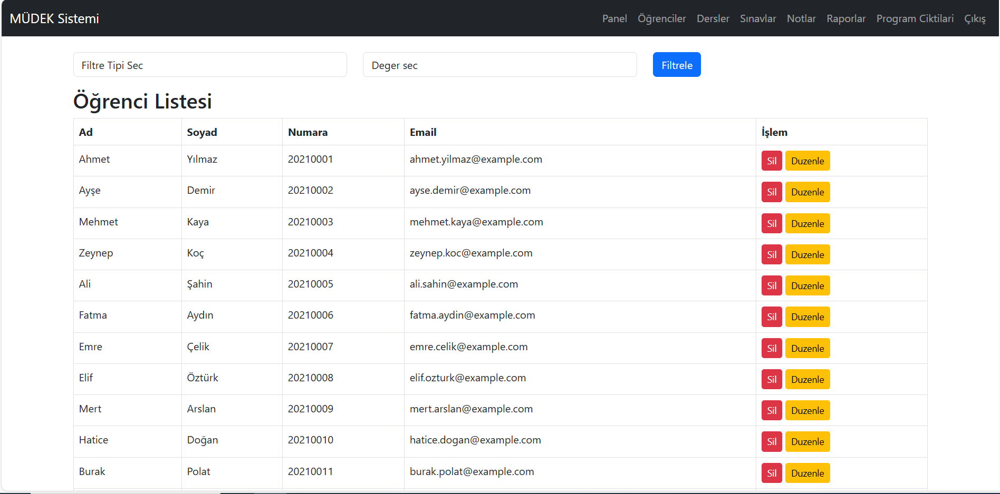
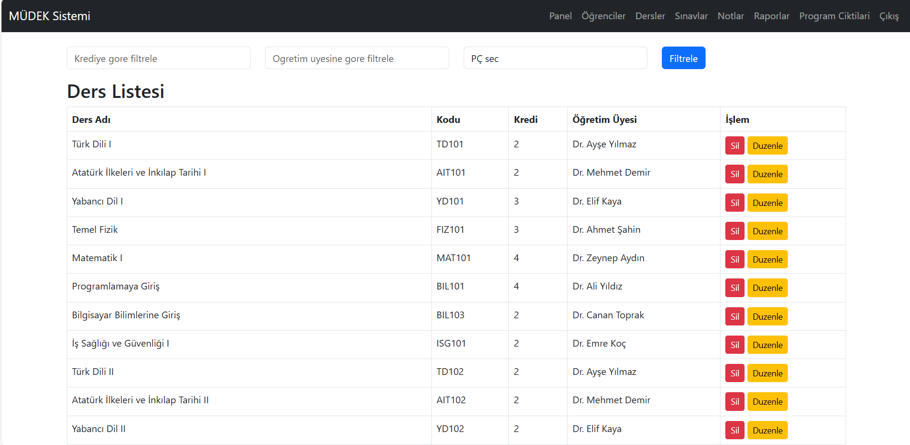
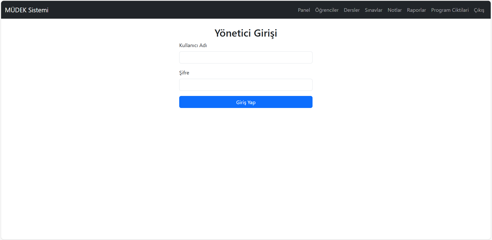
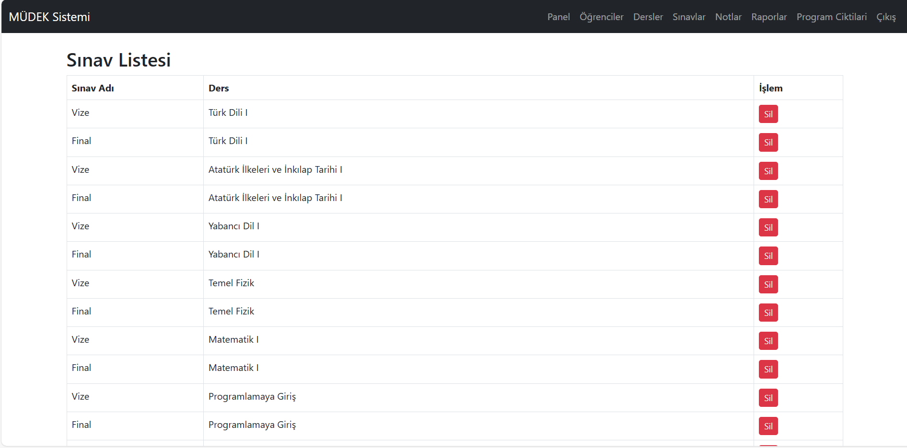

# ?? Müdek-System

MÜDEK akreditasyon süreci kapsamýnda program çýktýlarýnýn (PÇ) takibini kolaylaþtýrmak amacýyla geliþtirilmiþ web tabanlý bir sistemdir. Flask, MySQL, HTML/CSS ve JavaScript teknolojileriyle inþa edilmiþtir.

---

## ?? Özellikler

- ?? Program çýktýlarýnýn (PÇ) tanýmlanmasý ve düzenlenmesi
- ?? Öðrenci çýktýlarýnýn deðerlendirilmesi
- ????? Öðretim üyeleri tarafýndan veri giriþi
- ?? Raporlama ve çýktý analizleri
- ?? Kullanýcý giriþi ve yetkilendirme (admin/öðretim üyesi)

---

## ?? Kullanýlan Teknolojiler

- **Backend:** Python (Flask)
- **Veritabaný:** MySQL
- **Frontend:** HTML, CSS, JavaScript (gerekirse Bootstrap)
- **Versiyon Kontrol:** Git & GitHub

---

## ?? Kurulum (Yerel Geliþtirme)

### 1. Reponun klonlanmasý

```bash
git clone https://github.com/Palakonik/Mudek-System.git
cd Mudek-System

### 2. Sanal ortam oluþtur ve aktif et

conda create -n mudek-env python=3.10
conda activate mudek-env

### 3. Gerekli paketlerin yüklenmesi

pip install -r requirements.txt

### 4. Veritabaný yapýlandýrmasý

config.py veya .env dosyasýný düzenleyerek kendi MySQL kullanýcý adý ve þifreni gir.

### 5. Uygulamayý Baþlat

python run.py

## ?? Ekran Görüntüleri

### Ana Sayfa


### Raporlar Sayfasý


### Öðrenciler (Students) Sayfasý


### Dersler (Courses) Sayfasý


### Giriþ (Login) Sayfasý


### Sýnavlar (Exam) Sayfasý


### Notlar (Grades) Sayfasý


### Program Çýktýlarý (Program Outcomes) Sayfasý


?? Lisans
Bu proje MIT lisansý ile lisanslanmýþtýr. Ayrýntýlar için LICENSE dosyasýna göz atabilirsiniz.

?? Ýletiþim
Her türlü öneri veya katký için iletiþime geçebilirsin:

?? ihsan.gs125@gmail.com
?? GitHub: @Palakonik


