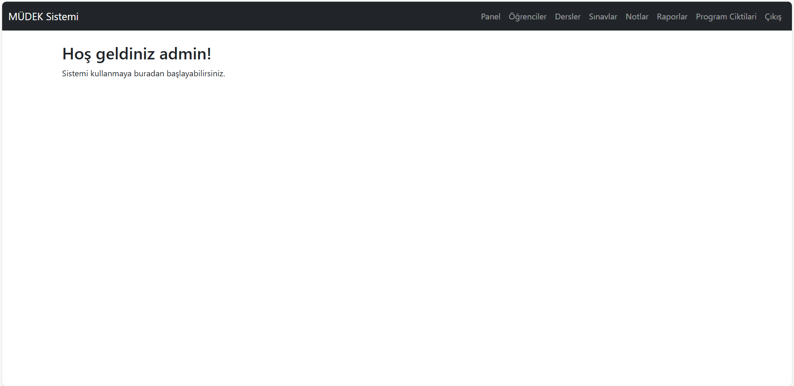
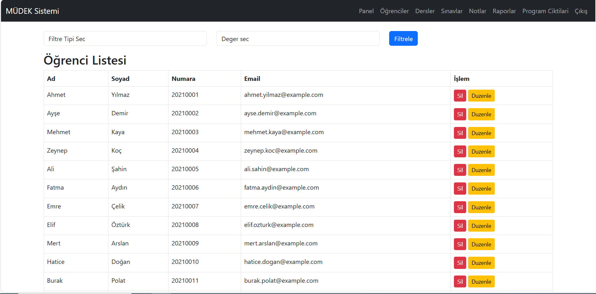
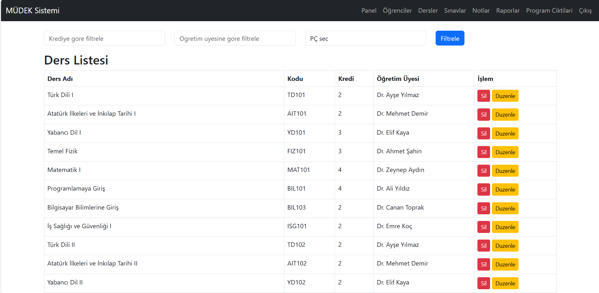
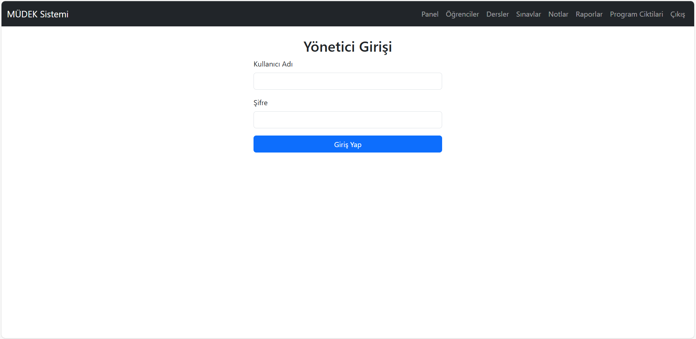
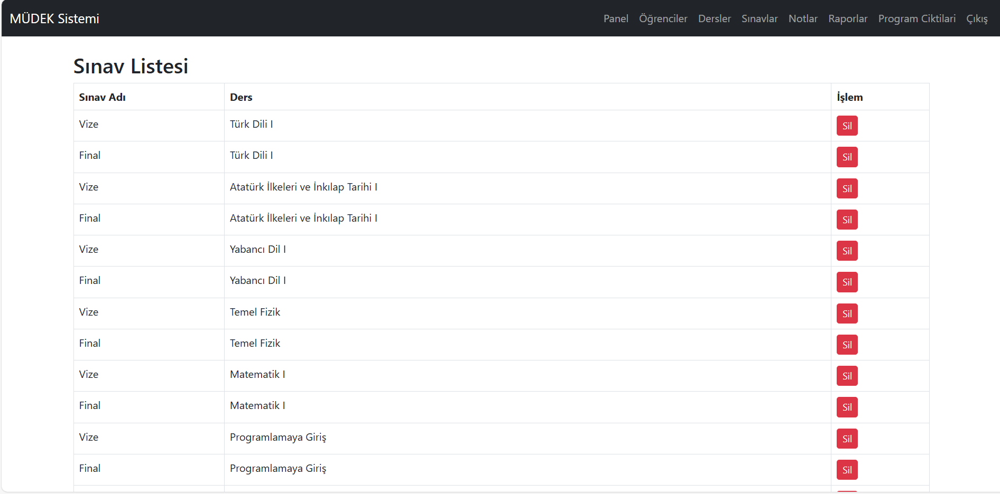
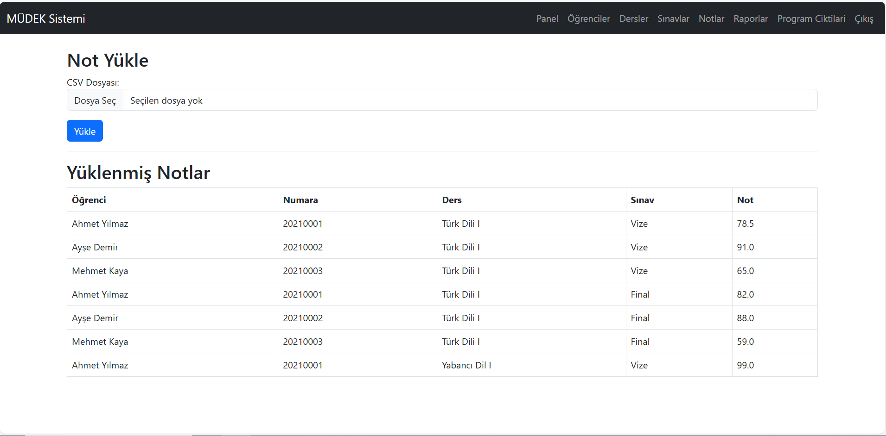
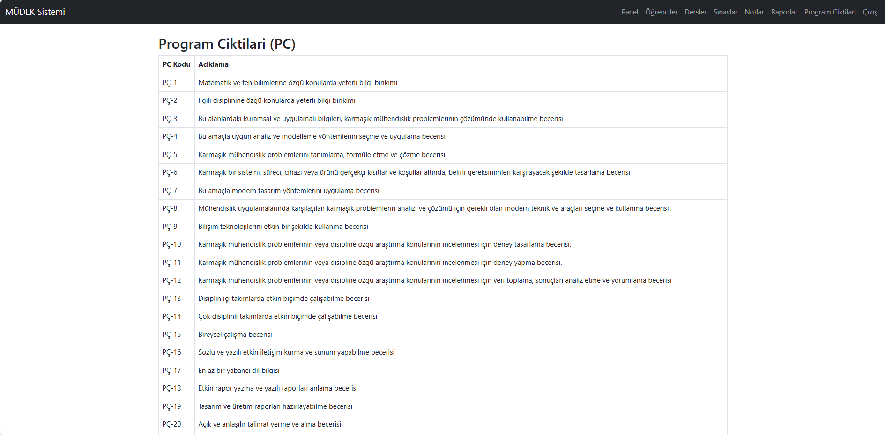

# 🎓 Müdek-System

MÜDEK akreditasyon süreci kapsamında program çıktılarının (PÇ) takibini kolaylaştırmak amacıyla geliştirilmiş web tabanlı bir sistemdir. Flask, MySQL, HTML/CSS ve JavaScript teknolojileriyle inşa edilmiştir.

---

## ✨ Özellikler

- 🎯 Program çıktılarının (PÇ) tanımlanması ve düzenlenmesi
- 📊 Öğrenci çıktılarının değerlendirilmesi
- 🧑‍🏫 Öğretim üyeleri tarafından veri girişi
- 📁 Raporlama ve çıktı analizleri
- 🔐 Kullanıcı girişi ve yetkilendirme (admin/öğretim üyesi)

---

## 🛠️ Kullanılan Teknolojiler

- **Backend:** Python (Flask)
- **Veritabanı:** MySQL
- **Frontend:** HTML, CSS, JavaScript (gerekirse Bootstrap)
- **Versiyon Kontrol:** Git & GitHub

---

## 🚀 Kurulum (Yerel Geliştirme)

### 1. Reponun klonlanması

```bash
git clone https://github.com/Palakonik/Mudek-System.git
cd Mudek-System
```

### 2. Sanal ortam oluştur ve aktif et

```bash
conda create -n mudek-env python=3.10
conda activate mudek-env
```

### 3. Gerekli paketlerin yüklenmesi

```bash
pip install -r requirements.txt
```

> Eğer `requirements.txt` yoksa şu komutla yükleyebilirsin:
```bash
pip install flask mysql-connector-python
```

### 4. Veritabanı yapılandırması

`config.py` veya `.env` dosyasını düzenleyerek kendi MySQL kullanıcı adı ve şifreni gir.

### 5. Uygulamayı Başlat

```bash
python run.py
```

Tarayıcında şu adrese giderek uygulamayı test edebilirsin:

```
http://127.0.0.1:5000
```

---

## 🖼️ Ekran Görüntüleri

### Ana Sayfa


### Raporlar Sayfası


### Öğrenciler (Students) Sayfası


### Dersler (Courses) Sayfası


### Giriş (Login) Sayfası


### Sınavlar (Exam) Sayfası


### Notlar (Grades) Sayfası


### Program Çıktıları (Program Outcomes) Sayfası


---

## 📄 Lisans

Bu proje MIT lisansı ile lisanslanmıştır. Ayrıntılar için `LICENSE` dosyasına göz atabilirsiniz.

---

## 📬 İletişim

Her türlü öneri veya katkı için iletişime geçebilirsin:

- 📧 ihsan.gs125@gmail.com  
- 🐙 GitHub: [@Palakonik](https://github.com/Palakonik)
